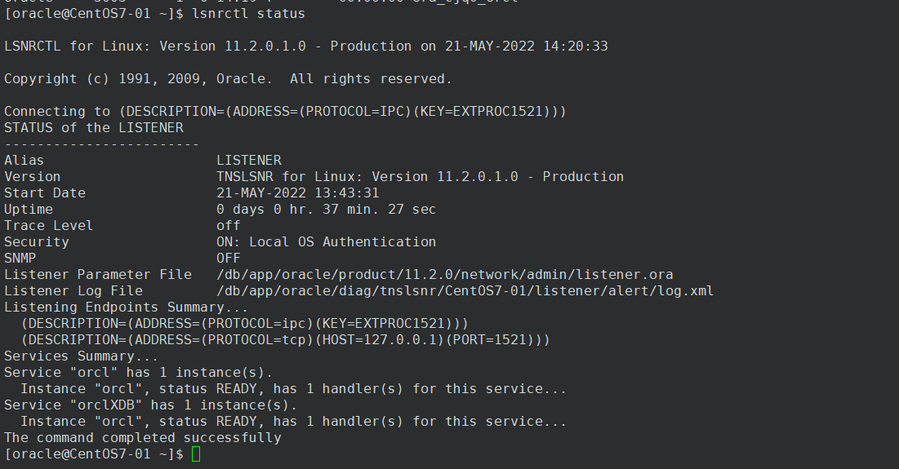

# c-ifp-starter

c-ifp-starter为项目开发工程，在此工程内完成公共代码，标准代码的开发。

代码开发完成后

1、commit，pull最新代码，解决冲突，push远程仓库；

2、pull最新代码 ，Gradle  >  Tasks   >   other 　>　 generateProto，所有模块的proto生成对应的java文件；

（此操作方式生成所有proto，操作简便，但耗费时间；也可以在做了修改的模块的proto目录下使用gradle工具仅生成当前proto对应的Java文件，耗时短）

3、Gradle  >  Tasks   >   upload ＞   uploadArchives，将所有模块代码达成jar包，并上传maven仓库；

（此操作方式将所有模块打包，操作简便，但耗费时间；也可以在做了修改的模块的proto目录下使用gradle工具仅生成当前模块对应的包并上传改包到maven仓库，耗时短）

`client、server、protocal做了修改的都要打包上传`

# ifp-live

ifp-live为打包工程，此工程内主要开发个性化代码，通用代码依赖于c-ifp-starter工程代码生成的jar包。

1、pull，从git仓库拉取最新个性化代码；

2、Gradle  >   reload all gradle projects 从maven仓库获取最新依赖，主要是更新获取c-ifp-starter工程打出的jar包依赖（可在External Libraries中查看修改后的jar包是否被拉下来）；

3、Gradle >  Task   >  bootRepackage/build 将所有模块生成生成打包生成对应得jar包，jar包位于buil目录下；

(也可以在使用了c-ifp-starter改动依赖的模块下使用gradle工具，仅将该模块打包，节省时间，)

4、将生成的jar包上传服务器对应目录（注意备份）

# 升级

注意：只需升级依赖被修改的包，如修改了c-ifp-starter工程中的ifp-fundtrate模块（ifp-fundtrate-client、ifp-fundtrate-server、ifp-fundtrate-protocal）,

而ifp-live工程ams-server-ifp-group模块依赖于ifp-fundtrate模块，那就需要升级ams-server-ifp-group

若c-ifp-starter工程中某个模块有protocol文件有修改，那么ifp-live工程ams-client-group也要升级

升级过程：

1、备份当前正在使用的jar包，用升级后的jar包替换正在使用的jar包，注意名字保持一致；进入对应的目录，运行asm stop关闭服务，再运行ams start开启服务；所有升级包都要执行这两个命令。

微服务升级对应目录


2、通过日志查看是否升级成功

3、主意上传jar包、执行命令时都已ftq用户，不要以root用户

命令过程

```
[ftq@centos194 ~]$ cd "/home/ftq/ams/c5-ifp-group"
[ftq@centos194 c5-ifp-group]$ ams stop
已执行命令[kill 25766]，进程稍后退出...
[ftq@centos194 c5-ifp-group]$ ams start
1、检查到当前脚本启动用户为：ftq
2、找到JAVA_HOME：[/home/ftq/jdk1.8.0_161]
3、搜索到[ams-server-ifp-group-0.0.1-SNAPSHOT.jar]，作为可运行文件使用.
4、JVM参数：[-server -Xms512m -Xmx2048m -Xss1024k -XX:MetaspaceSize=128m -XX:MaxMetaspaceSize=512m -Djava.awt.headless=true -XX:+HeapDumpOnOutOfMemoryError -Dspring.profiles.active=c5dev -XX:HeapDumpPath=./apex-ams-fcb5e3d6.dump -Dapp.unique.pid=apex-ams-fcb5e3d6 ]

…………

[ftq@centos194 c5-web-app]$ pwd
/home/ftq/ams/c5-web-app
[ftq@centos194 c5-web-app]$ ams stop
已执行命令[kill 11598]，进程稍后退出...
[ftq@centos194 c5-web-app]$ ams start
1、检查到当前脚本启动用户为：ftq
2、找到JAVA_HOME：[/home/ftq/jdk1.8.0_161]
3、搜索到[ams-client-group-1.0.1.jar]，作为可运行文件使用.
4、JVM参数：[-server -Xms512m -Xmx2048m -Xss1024k -XX:MetaspaceSize=128m -XX:MaxMetaspaceSize=512m -Djava.awt.headless=true -XX:+HeapDumpOnOutOfMemoryError -Dspring.profiles.active=c5dev -XX:HeapDumpPath=./apex-ams-116851c6.dump -Dapp.unique.pid=apex-ams-116851c6 -Xms512m  -Xmx2048m -Xss1024k  -XX:MetaspaceSize=256m -XX:MaxMetaspaceSize=1024m ]
[ftq@centos194 c5-web-app]$ ls 
ams                                ams-client-group-1.0.1.jar0308    ams-client-group-1.0.1.jar0310-1   config       logs
ams-client-group-1.0.1.jar         ams-client-group-1.0.1.jar0308-1  ams-client-group-1.0.1.jar0310ycy  current.pid  phantom
ams-client-group-1.0.1.jar0302ycy  ams-client-group-1.0.1.jar0309    ams-client-group-1.0.1.jar0311     jvm.options
[ftq@centos194 c5-web-app]$ cd logs
[ftq@centos194 logs]$ ls
2022-02  current.pid  mot  webapp-base.log
[ftq@centos194 logs]$ tail -f webapp-base.log 
2022-03-11 15:54:26,274:INFO main (DefaultLazyPropertyResolver.java:34) - Property Resolver custom Bean not found with name 'encryptablePropertyResolver'. Initializing Default Property Resolver
2022-03-11 15:54:26,274:INFO main (DefaultLazyPropertyDetector.java:31) - Property Detector custom Bean not found with name 'encryptablePropertyDetector'. Initializing Default Property Detector
2022-03-11 15:54:26,783:INFO main (DirectJDKLog.java:180) - Initializing ProtocolHandler ["http-nio-8020"]
2022-03-11 15:54:26,808:INFO main (DirectJDKLog.java:180) - Starting service [Tomcat]
2022-03-11 15:54:26,811:INFO main (DirectJDKLog.java:180) - Starting Servlet Engine: Apache Tomcat/8.5.32
2022-03-11 15:54:26,989:INFO localhost-startStop-1 (DirectJDKLog.java:180) - Initializing Spring embedded WebApplicationContext
2022-03-11 15:54:34,095:INFO main (EpollProvider.java:69) - Starting without optional Epoll library
2022-03-11 15:54:34,101:INFO main (KqueueProvider.java:71) - Starting without optional kqueue library
2022-03-11 15:54:34,586:WARN main (ElasticsearchReporterService.java:44) - ams.metrics.es.hosts is empty
2022-03-11 15:54:36,543:WARN main (ESRestClient.java:22) - ElasticSearch cluster nodes not found!
2022-03-11 15:54:39,232:WARN main (FreeMarkerAutoConfiguration.java:93) - Cannot find template location(s): [classpath:/mould/] (please add some templates, check your FreeMarker configuration, or set spring.freemarker.checkTemplateLocation=false)
2022-03-11 15:54:39,975:INFO main (DirectJDKLog.java:180) - Initializing ProtocolHandler ["http-nio-0.0.0.0-10001"]
2022-03-11 15:54:39,976:INFO main (DirectJDKLog.java:180) - Starting service [Tomcat]
2022-03-11 15:54:39,976:INFO main (DirectJDKLog.java:180) - Starting Servlet Engine: Apache Tomcat/8.5.32
2022-03-11 15:54:39,989:INFO localhost-startStop-1 (DirectJDKLog.java:180) - Initializing Spring embedded WebApplicationContext
2022-03-11 15:54:40,356:WARN main (RequestCollector.java:83) - ams.metrics.es.hosts is empty
2022-03-11 15:54:40,356:WARN main (RequestCollector.java:94) - request collector init cancel.
2022-03-11 15:54:40,364:INFO main (DirectJDKLog.java:180) - Starting ProtocolHandler ["http-nio-0.0.0.0-10001"]
2022-03-11 15:54:40,367:INFO main (DirectJDKLog.java:180) - Using a shared selector for servlet write/read
2022-03-11 15:54:40,802:WARN main (ModelPropertyPlugin.java:37) - Swagger属性定义get/set函数非法定义:[Property 'comment'; ctors: null, field(s): null, getter(s): [method com.apexsoft.aas.modules.client.model.ClientSetting#getComment(0 params)][visible=true,ignore=false,explicitName=false], setter(s): [method com.apexsoft.aas.modules.client.model.ClientSetting#setComment(1 params)][visible=true,ignore=false,explicitName=false]]
2022-03-11 15:54:40,902:WARN main (ModelPropertyPlugin.java:37) - Swagger属性定义get/set函数非法定义:[Property 'comment'; ctors: null, field(s): null, getter(s): [method com.apexsoft.aas.authentication.simple.model.Component#getComment(0 params)][visible=true,ignore=false,explicitName=false], setter(s): [method com.apexsoft.aas.authentication.simple.model.Component#setComment(1 params)][visible=true,ignore=false,explicitName=false]]
2022-03-11 15:54:40,929:WARN main (ModelPropertyPlugin.java:37) - Swagger属性定义get/set函数非法定义:[Property 'innerMap'; ctors: null, field(s): null, getter(s): [method com.alibaba.fastjson.JSONObject#getInnerMap(0 params)][visible=true,ignore=false,explicitName=false], setter(s): null]
2022-03-11 15:54:40,930:WARN main (ModelPropertyPlugin.java:37) - Swagger属性定义get/set函数非法定义:[Property 'empty'; ctors: null, field(s): null, getter(s): [method com.alibaba.fastjson.JSONObject#isEmpty(0 params)][visible=true,ignore=false,explicitName=false], setter(s): null]
2022-03-11 15:54:40,974:WARN main (ModelPropertyPlugin.java:37) - Swagger属性定义get/set函数非法定义:[Property 'comment'; ctors: null, field(s): null, getter(s): [method com.apexsoft.aas.modules.client.model.ClientSetting#getComment(0 params)][visible=true,ignore=false,explicitName=false], setter(s): [method com.apexsoft.aas.modules.client.model.ClientSetting#setComment(1 params)][visible=true,ignore=false,explicitName=false]]
2022-03-11 15:54:40,999:WARN main (ModelPropertyPlugin.java:32) - Swagger属性未设置get/set函数:Optional.of(public long com.apexsoft.aas.authentication.simple.api.pkg.PermissionRequest$Delete$Param.id)
2022-03-11 15:54:41,022:WARN main (ModelPropertyPlugin.java:37) - Swagger属性定义get/set函数非法定义:[Property 'comment'; ctors: null, field(s): null, getter(s): [method com.apexsoft.aas.authentication.simple.model.Role#getComment(0 params)][visible=true,ignore=false,explicitName=false], setter(s): [method com.apexsoft.aas.authentication.simple.model.Role#setComment(1 params)][visible=true,ignore=false,explicitName=false]]
2022-03-11 15:54:41,034:WARN main (ModelPropertyPlugin.java:32) - Swagger属性未设置get/set函数:Optional.of(public long com.apexsoft.aas.authentication.simple.api.pkg.PermissionRequest$Delete$Param.id)
2022-03-11 15:54:41,063:WARN main (ModelPropertyPlugin.java:37) - Swagger属性定义get/set函数非法定义:[Property 'comment'; ctors: null, field(s): null, getter(s): [method com.apexsoft.aas.authentication.simple.model.Component#getComment(0 params)][visible=true,ignore=false,explicitName=false], setter(s): [method com.apexsoft.aas.authentication.simple.model.Component#setComment(1 params)][visible=true,ignore=false,explicitName=false]]
2022-03-11 15:54:41,086:WARN main (ModelPropertyPlugin.java:37) - Swagger属性定义get/set函数非法定义:[Property 'user'; ctors: null, field(s): null, getter(s): [method com.apexsoft.aas.authentication.common.UserAuthResponse#getUser(0 params)][visible=true,ignore=false,explicitName=false], setter(s): null]
2022-03-11 15:54:41,091:WARN main (ModelPropertyPlugin.java:37) - Swagger属性定义get/set函数非法定义:[Property 'comment'; ctors: null, field(s): null, getter(s): [method com.apexsoft.aas.authentication.simple.model.Role#getComment(0 params)][visible=true,ignore=false,explicitName=false], setter(s): [method com.apexsoft.aas.authentication.simple.model.Role#setComment(1 params)][visible=true,ignore=false,explicitName=false]]
2022-03-11 15:54:41,103:WARN main (ModelPropertyPlugin.java:37) - Swagger属性定义get/set函数非法定义:[Property 'commonGrpcService'; ctors: null, field(s): null, getter(s): [method com.apexsoft.aas.modules.helper.model.AmsServiceBean#isCommonGrpcService(0 params)][visible=true,ignore=false,explicitName=false], setter(s): null]
2022-03-11 15:54:41,103:WARN main (ModelPropertyPlugin.java:37) - Swagger属性定义get/set函数非法定义:[Property 'key'; ctors: null, field(s): null, getter(s): [method com.apexsoft.aas.modules.helper.model.AmsServiceBean#getKey(0 params)][visible=true,ignore=false,explicitName=false], setter(s): null]
2022-03-11 15:54:41,114:WARN main (ModelPropertyPlugin.java:37) - Swagger属性定义get/set函数非法定义:[Property 'extJSON'; ctors: null, field(s): null, getter(s): [method com.apexsoft.aas.common.AuthRequest#getExtJSON(0 params)][visible=true,ignore=false,explicitName=false], setter(s): null]
2022-03-11 15:54:45,143:WARN main (ModelPropertyPlugin.java:37) - Swagger属性定义get/set函数非法定义:[Property 'dt'; ctors: null, field(s): null, getter(s): [method com.apexsoft.crm.iraaassetallocation.model.QueryPortfolioPoolChangeModel#getDt(0 params)][visible=true,ignore=false,explicitName=false], setter(s): [method com.apexsoft.crm.iraaassetallocation.model.QueryPortfolioPoolChangeModel#setDt(1 params)][visible=true,ignore=false,explicitName=false]]
2022-03-11 15:54:45,241:WARN main (ModelPropertyPlugin.java:32) - Swagger属性未设置get/set函数:Optional.of(private java.lang.Integer com.apexsoft.crm.iraaassetallocation.model.QueryServiceProcessExecuteSituationModel.qryTp)
2022-03-11 15:54:46,651:WARN main (ModelPropertyPlugin.java:37) - Swagger属性定义get/set函数非法定义:[Property 'tgtId'; ctors: null, field(s): null, getter(s): [method com.apexsoft.crm.iraafinancialproducts.model.QueryPstnStyleModel#getTgtId(0 params)][visible=true,ignore=false,explicitName=false], setter(s): [method com.apexsoft.crm.iraafinancialproducts.model.QueryPstnStyleModel#setTgtId(1 params)][visible=true,ignore=false,explicitName=false]]
2022-03-11 15:54:48,317:INFO main (DirectJDKLog.java:180) - Starting ProtocolHandler ["http-nio-8020"]
2022-03-11 15:54:48,318:INFO main (DirectJDKLog.java:180) - Using a shared selector for servlet write/read
2022-03-11 15:54:48,331:INFO main (StartupInfoLogger.java:57) - Started WebApplication in 40.461 seconds (JVM running for 41.728)
^C
[ftq@centos194 logs]$ jps
25936 jar
17413 jar
20951 jar
15447 jar
2985 QuorumPeerMain
5961 war
10425 jar
28843 jar
18220 jar
32684 Jps
31805 jar
27295 war
[ftq@centos194 logs]$ ^C
```

# 环境分支

公司环境使用：dev分支

东方现场环境使用：dev_orientsec分支

注意：利用开发工程和打包工程进行升级时，注意分支要保持一致。通过build.gradle文件可以查看工程的版本，保证开发工程和打包工程版本一致。

# 开发工程测试

利用swagger测试开发工程

http://192.168.4.194:8040/ftq/swagger-ui.html#

# Git 提交规范

### Commit Message 格式

```plain
<type><#TaskID>: <subject>
<BLANK LINE>
<task title>
<BLANK LINE>
<body>
```

### \<type>

用于说明 commit 的类别，只允许使用下面7个标识。

- feat: 新功能（feature）
- fix: 修补bug
- docs: 文档、补充代码注释
- style: 代码格式（不影响代码运行的变动）
- refactor: 重构（既不是新增功能，也不是修改bug的代码变动）
- test: 增加测试
- chore: 杂务，配置项值改动，构建过程或辅助工具的变动

### <#TaskID>

TaskID 部分是本次 commit 对应的PMS任务ID，没有的话，可以省略。

```plain
fix#43731: 修复****
feat#43732: 开发****模块
```

### \<subject>

Subject 部分是本次 commit 目的的简短描述;

不建议直接使用pms标题，因为pms标题通常是描述需求或者bug，有时候不能反应代码具体的内容;

### \<task title>

Task title 部分是本次 commit 对应的PMS任务标题，如果和 subject 重复了，可以省略。

### \<body>

Body 部分是本次 commit 的详细描述，说明代码变动的时机，以及与以前行为的对比。任务较简单情况下，可省略。

### 完整例子

```plain
fix#43731: 解决幂运算结果为复数complex类型的问题

算法平台-贝塔系数：脚本执行异常报错

当Python进行幂运算时，如果底数是负数，且指数为分数的情况下，返回的结果是复数，与预期结果不同。解决方法是，自定义了幂运算函数 alg_pow(x, y)，当遇到上述情况时，将底数的负号提取出来，计算完幂结果后，再将结果加上负号。
```

### 代码提交建议

- 每一次的代码提交保持相对独立，不要在一次提交中上传多个任务或者多个功能点的代码。
- 工作量较大的任务要按功能或者模块拆分作多次提交。
- 工作量较小的任务和每个BUB修复的工作应只作一次提交。

这样做的意义是方便对某个任务或者某个功能点进行代码迁移或还原的操作。


protocal每个“类”对应生成一个同名.java文件和一个名字+Builder.java文件

client和server都依赖于protocol


因此protocol做了修改，client、server都得打包上传。打包工程ams-client-group依赖于开发工程client，ams-server-group依赖于开发工程server

# Tomcat重启后无法登录

一般在tomcat重启后可以正常登录，若是在重启期间，有人尝试登录过，那么tomcat重启可能就无法正常登录，这时需要重启网关，可以解决。主要网关和tomcat的重启都不要使用root用户。

总结：1、重启tomcat	2、重启网关

网关重启：进入又jar文件的网关目录，`ams stop`关闭网关		`ams start`开启网关


# W5部署

## jdk卸载

1、查看是否安装jdk

```
[root@oracle-11g ftq]#java -version
java version "1.8.0_321"
Java(TM) SE Runtime Environment (build 1.8.0_321-b07)
Java HotSpot(TM) 64-Bit Server VM (build 25.321-b07, mixed mode)
```

2、查看jdk安装路径

```
[root@oracle-11g ftq]#which java
/home/ftq/jdk1.8.0_321/bin/java
```

3、卸载jdk

```
[root@oracle-11g ftq]#rm -rf /home/ftq/jdk1.8.0_321/
```

4、删除环境变量

```
[root@oracle-11g /]#vim /etc/profile
```


5、使用source命令使修改后的profile文件立即生效

```
[root@oracle-11g etc]#source profile
```

## jdk下载


## jdk安装

1、解压安装包

```
[root@oracle-11g ftq]#tar zxvf jdk-8u333-linux-x64.tar.gz
```

2、设置环境变量

编辑文件profile， 必须切换成root用户下

执行 vi /etc/profile

在/etc/profile最后加上以下脚本,并保存

```
export JAVA_HOME=/home/ftq/jdk1.8.0_333
export PATH=$JAVA_HOME/bin:$PATH
export CLASSPATH=.:$JAVA_HOME/lib/tools.jar:$JAVA_HOME/lib/dt.jar:$CLASSPATH   --把$PATH写到后面，可以避免多个jdk存在的影响
```


3、环境变量生效

```
source /etc/profile
```

4、验证

```
java -version
```

显示以下版本号表示java安装成功，如图


# oracle卸载

**进程查看**


切换oracle用户结果


**关闭监听**

```
[root@oracle-11g ~]#su - oarcle			--- 切换用户
su: user oarcle does not exist
[root@oracle-11g ~]#su - oracle
Last login: Thu May 19 09:41:27 CST 2022 on pts/0
-bash-4.2$ lsnrctl stop					--- 关闭监听

LSNRCTL for Linux: Version 11.2.0.1.0 - Production on 19-MAY-2022 09:43:46

Copyright (c) 1991, 2009, Oracle.  All rights reserved.

Connecting to (DESCRIPTION=(ADDRESS=(PROTOCOL=IPC)(KEY=EXTPROC1521)))
The command completed successfully
```


监听已被关闭结果如上图

**关闭实例**

```
[root@oracle-11g ~]#su - oracle												--- 切换oracle用户
Last login: Thu May 19 09:42:52 CST 2022 on pts/0
-bash-4.2$ sqlplus / as sysdba												--- 通过sqlplus 以管理员用户连接到数据库

SQL*Plus: Release 11.2.0.1.0 Production on Thu May 19 09:47:39 2022

Copyright (c) 1982, 2009, Oracle.  All rights reserved.


Connected to:
Oracle Database 11g Enterprise Edition Release 11.2.0.1.0 - 64bit Production
With the Partitioning, OLAP, Data Mining and Real Application Testing options

SQL> shutdown immediate;   													--- 关闭数据库实例
Database closed.															--- 表明数据库实例已经关闭
Database dismounted.														--- 表明数据库实例已经关闭
exitORACLE instance shut down.												--- 表明数据库实例已经关闭
SQL> exit;																	--- 退出数据库连接
Disconnected from Oracle Database 11g Enterprise Edition Release 11.2.0.1.0 - 64bit Production
With the Partitioning, OLAP, Data Mining and Real Application Testing options
-bash-4.2$ exit																--- 退出Oracle用户，回到root用户
logout
```

**再次查看监听和实例是否已关闭**

```
[root@oracle-11g ~]#ps -ef | grep oracle
root     25364 30754  0 09:41 pts/0    00:00:00 su - oracle
oracle   25365 25364  0 09:41 pts/0    00:00:00 -bash
root     27694 25829  0 09:49 pts/0    00:00:00 grep --color=auto oracle
[root@oracle-11g ~]#
```


## oracke卸载步骤

1.使用SQL*PLUS停止数据库 ，如果不能通过sysdba登陆可以用nolog用户登陆后切换至sysdba

```
[oracle@OracleTest oracle]$ sqlplus /nolog
SQL> connect / as sysdba
SQL> shutdown [immediate]
SQL> exit   
```

2.停止Listener 

```
[oracle@OracleTest oracle]$ lsnrctl stop  
```

4.切换用户 ，用su或者重新登录到root(如用户想重新安装可以保留oracle用户，省得输入环境变量了)   

5.删除以下目录 

```
[root@OracleTest /root]# rm -rf /u01/app/oracle/
[root@OracleTest /root]# rm /usr/local/bin/dbhome
[root@OracleTest /root]# rm /usr/local/bin/oraenv
[root@OracleTest /root]# rm /usr/local/bin/coraenv
[root@OracleTest /root]# rm /etc/oratab
[root@OracleTest /root]# rm /etc/oraInst.loc 
```

6.将oracle用户和用户组删除(若要重新安装,可以不删除) 

```
[root@OracleTest /root]# userdel –r oracle
[root@OracleTest /root]# groupdel oinstall
[root@OracleTest /root]# groupdel dba
```

https://blog.51cto.com/u_8887390/3298816


创建用户组和oracle用户

```
[root@oracle-11g ~]#groupadd oinstall   --- 创建用户组oinstall
[root@oracle-11g ~]#groupadd dba	    --- 创建用户组dba
[root@oracle-11g ~]#useradd -g oinstall -g dba -m oracle --- 创建用户oracle
Creating mailbox file: File exists
[root@oracle-11g ~]#passwd oracle		--- 设置oracle用户密码
Changing password for user oracle.
New password: 							--- 输入密码
BAD PASSWORD: The password contains the user name in some form
Retype new password: 					--- 确认密码
passwd: all authentication tokens updated successfully.
[root@oracle-11g ~]#id oracle 			--- 查看新建立的oracle用户
uid=1002(oracle) gid=1003(dba) groups=1003(dba)
[root@oracle-11g ~]#
```


修改文件推荐使用vim 命令，使用vi命令有时修改内容会不显示，无法判断是否已经修改。


**波浪号 '~' 的作用:表示个人用户的家目录**





vim 跳转到指定行：

命令模式下：行号 + G 。eg：66 G---->跳转到66行

**注意：oracle命令执行过程中，有时比较费时间会进入等待状态，此时光标会以块的形式存在，当出现[oracle@CentOS7-01 ~]$ 这种语句才表示命令执行完毕，无论命令能否正确执行，执行完毕的标是[oracle@CentOS7-01 ~]$ ，因此在命令执行过程中若遇到等待情况需要耐性等待，不要按回车或其他键使命令半途终止。**


查看某个包是否已经安装：eg：查看ksh-20120801-143.el7_9.x86_64包

```
[root@oracle-11g tmp]#rpm -qa|grep ksh ----这个命令只在支持rpm的inux版本上有效
ksh-20120801-143.el7_9.x86_64 --- 此包已安装
```

产看某个包的安装目录    eg：查看ksh-20120801-143.el7_9.x86_64包的安装目录

```
[root@oracle-11g tmp]#rpm -ql ksh-20120801-143.el7_9.x86_64  ---这个命令只在支持rpm的inux版本上有效
/bin/ksh
/bin/ksh93
/bin/rksh
/etc/binfmt.d/kshcomp.conf
/etc/kshrc
/etc/skel/.kshrc
/usr/bin/shcomp
/usr/share/doc/ksh-20120801
/usr/share/doc/ksh-20120801/COMPATIBILITY
/usr/share/doc/ksh-20120801/RELEASE
/usr/share/doc/ksh-20120801/TYPES
/usr/share/man/man1/ksh.1.gz
/usr/share/man/man1/ksh93.1.gz
[root@oracle-11g tmp]#
```

查看文件或目录的所在路径可以使用以下命令：

```
which yum
whereis yum
find / -name "yum"
```

https://blog.csdn.net/qq_22764659/article/details/121728645

https://wenku.baidu.com/view/e6df1b5e8d9951e79b89680203d8ce2f00666585.html

https://jingyan.baidu.com/article/86112f1378bf282737978730.html

rpm -qal |grep  ksh-20120801-143.el7_9.x86_64 查看 ksh-20120801-143.el7_9.x86_64所有安装包的文件存储位置

```
[root@oracle-11g tmp]#rpm -qal |grep ksh
/usr/share/zoneinfo/America/Danmarkshavn
/usr/share/zoneinfo/posix/America/Danmarkshavn
/usr/share/zoneinfo/right/America/Danmarkshavn
/usr/share/vim/vim74/doc/workshop.txt.gz
/bin/ksh
/bin/ksh93
/bin/rksh
/etc/binfmt.d/kshcomp.conf
/etc/kshrc
/etc/skel/.kshrc
/usr/share/doc/ksh-20120801
/usr/share/doc/ksh-20120801/COMPATIBILITY
/usr/share/doc/ksh-20120801/RELEASE
/usr/share/doc/ksh-20120801/TYPES
/usr/share/man/man1/ksh.1.gz
/usr/share/man/man1/ksh93.1.gz
/usr/lib/firewalld/services/kshell.xml
```

卸载某个安装了的包

```
[root@oracle-11g tmp]#rpm -qa|grep ksh-20120801-143.el7_9.x86_64
ksh-20120801-143.el7_9.x86_64
[root@oracle-11g tmp]# yum -y remove grep ksh-20120801-143.el7_9.x86_64
```

https://www.linuxprobe.com/linux-remove-package.html


```
[oracle@localhost ~]$ lsnrctl status               ---------------------------------- 查看服务器端监听服务是否启动，以下结果表明服务端监听服务未启动

LSNRCTL for Linux: Version 11.2.0.1.0 - Production on 23-MAY-2022 11:53:09

Copyright (c) 1991, 2009, Oracle.  All rights reserved.

Connecting to (ADDRESS=(PROTOCOL=tcp)(HOST=)(PORT=1521))
TNS-12541: TNS:no listener
 TNS-12560: TNS:protocol adapter error
  TNS-00511: No listener
   Linux Error: 111: Connection refused
[oracle@localhost ~]$ lsnrctl start              ------------------------------------ 启动服务端监听服务

LSNRCTL for Linux: Version 11.2.0.1.0 - Production on 23-MAY-2022 11:53:27

Copyright (c) 1991, 2009, Oracle.  All rights reserved.

Starting /home/oracle/product/11.2.0//bin/tnslsnr: please wait...

TNSLSNR for Linux: Version 11.2.0.1.0 - Production
Log messages written to /home/oracle/diag/tnslsnr/localhost/listener/alert/log.xml
Listening on: (DESCRIPTION=(ADDRESS=(PROTOCOL=tcp)(HOST=localhost)(PORT=1521)))

Connecting to (ADDRESS=(PROTOCOL=tcp)(HOST=)(PORT=1521))
STATUS of the LISTENER
------------------------
Alias                     LISTENER
Version                   TNSLSNR for Linux: Version 11.2.0.1.0 - Production
Start Date                23-MAY-2022 11:53:27
Uptime                    0 days 0 hr. 0 min. 0 sec
Trace Level               off
Security                  ON: Local OS Authentication
SNMP                      OFF
Listener Log File         /home/oracle/diag/tnslsnr/localhost/listener/alert/log.xml
Listening Endpoints Summary...
  (DESCRIPTION=(ADDRESS=(PROTOCOL=tcp)(HOST=localhost)(PORT=1521)))
The listener supports no services
The command completed successfully
[oracle@localhost ~]$ lsnrctl status            ------------------------------------ 再次产看服务端监听服务，一下内容表明服务端监听服务启动成功

LSNRCTL for Linux: Version 11.2.0.1.0 - Production on 23-MAY-2022 11:53:33

Copyright (c) 1991, 2009, Oracle.  All rights reserved.

Connecting to (ADDRESS=(PROTOCOL=tcp)(HOST=)(PORT=1521))
STATUS of the LISTENER
------------------------
Alias                     LISTENER
Version                   TNSLSNR for Linux: Version 11.2.0.1.0 - Production
Start Date                23-MAY-2022 11:53:27
Uptime                    0 days 0 hr. 0 min. 6 sec
Trace Level               off
Security                  ON: Local OS Authentication
SNMP                      OFF
Listener Log File         /home/oracle/diag/tnslsnr/localhost/listener/alert/log.xml
Listening Endpoints Summary...
  (DESCRIPTION=(ADDRESS=(PROTOCOL=tcp)(HOST=localhost)(PORT=1521)))
The listener supports no services
The command completed successfully
[oracle@localhost ~]$ 
```


配置文件修改


