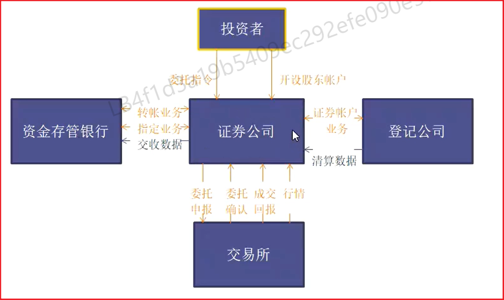
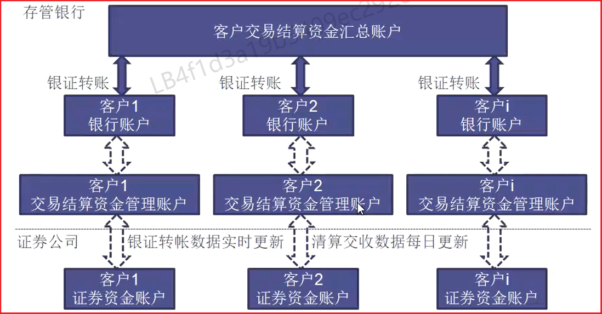

# 基本概念

## 什么是证券

证券是用来证明证券持有人有权取得相应权益的凭证

## 什么是证券交易

证券交易是指已发行的证券在证券市场上买卖的活动

## 证券交易的特征

证券交易特征：流动性、收益性、风险性

## 证券交易种类

1. 股票交易：有限责任公司发行，无固定时限；投资者和投资者之间的交易
2. 债券交易：国家、大企业发行，有保证。有一定的存活期，按一定的利率支付利息，到期偿还本金；投资者和投资者之间的交易
3. 基金交易：由专业机构募集资金后进行投资，利益共享，风险共担。
   - 封闭式基金：募集金额达到预期申请上市前，进行封闭，不能再加入或退出
   - 开放式基金：随时加入退出
4. 金融衍生工具交易
   - 权证交易：本质是一种合同交易
   - 金融期货交易
   - 金融期权交易
   - 可转换债券交易
   
   **注意：基金也属于证券**

## 证券交易方式

1. 现货交易：投资者-投资者交易
2. 远期交易和期货交易：投资者-投资者交易
3. 回购交易：投资者-投资者交易
4. 信用交易：投资者-证券公司交易

# 证券交易组成要素

## 证券投资者

证券投资者是买卖的主体，可以是自然人（个人投资者）也可以是法人（机构投资者）

## 证券公司

证券公司为投资者提供代理证券买卖的中介服务；证券公司也是证券市场上的机构投资者

## 证券交易场所

证券交易场所是供已发行的证券进行流通转让的市场，又称场内交易市场，组织形式有会员制和公司制两种，我国上海证券交易所和深圳证券交易所都采用会员制。

## 证券登记结算机构

证券登记结算机构是为证券交易提供集中登记、存管与结算服务，不以营利为目的的法人。

## 会员

证券公司具备一定资质后，向证券交易所提交申请，并提供必要文件，经证券交易所理事会批准后，可成为证券交易所的会员。

## 交易席位

传统意义上，交易席位是证券公司在证券交易所交易大厅内进行交易的固定位置，其实质还包括了交易资格的含义，即取得了交易席位后才能从事实际的证券交易业务，同时交易席位代表了会员在证券交易所拥有的权益，是会员享有交易权限的基础。。

## 交易单元

交易单元是指证券交易所会员取得席位后向证券交易所申请设立的参与证券交易所证券交易与接受证券交易所监管及服务的基本业务单位，交易单元是交易权限的技术载体，会员参与交易及会员权限的管理通过交易单元来实现。

如证券公司取得交易席位后，具有股票交易单元才能进行股票交易，具有债券交易单元才能进行债券交易。 

# 证券交易流程

## 证券账户

证券账户是指中国结算公司为申请失开出的记载其证券持有及变更的权利凭证。

## 证券托管制度

## 资金帐户

资金账户是用于管理投资者买卖证券的交易结算资金的账户

## 三方存管

指客户交易结算资金由独立于券商的第三方存管机构管理。第三方存管机构按照法律法规的要求，负责客户交剔结算资金的存管以及客户的资金存取等。这里的第三方机构，指具备存管资格的商业银行。目前第三方存管业务只针对人民币资金，不适用于B股外币资金。

## 为什么要实行第三方存管

《证券法》第六章第一百三十九条规定证券公司客户的交易结算资金应当存放在商业银行，以每个客户的名义单独立户管理。
“客户交易结算资金第三方存管”的实施有效避免了券商挪用客户交易结算资金，防范系统风险，维护证券市场的稳定，更好地保护投资者利益。

## 三方存管的签约模式

1. 券商端预指定、存管银行签约确认
2. 券商端一端签约
3. 银行端一端签约
4. 混合模式

## 委托

委托：投资者向经纪商下达买进或卖出证券的指令，称为委托

委托有哪些形式（现场、非现场）

1. 柜台（现场）
2. 非柜台（非现场）人工电话委托、自助和电话自动委托、网上委托..…委托要素（证券账号、日期、品种、买卖方向、数量、价格、时间）

## 委托时间

开市时间（9：00-11：30，13：00-15：00）
闭市时间（15：00）
集合竞价时间（9：13-9：25）
上海连续竞价时间（9：30-11：30，13：00-14：57）
深圳连续竞价时间（9：30-11：30，13：00-14：57）
深圳收盘集合竞价时间（14：57-15：00）
夜市委托（清算结束-下个交易日开市前）

## 委托价格

行情

委托界面的行情揭示

开盘价：由集合竞价产生

收盘价：闭市前最后一笔成交价格

买卖盘：未能马上成交的买入或者卖出申报的揭示涨跌幅：涨跌幅价格=前收盘价×（1士涨跌幅比例）

报价单位：申报价格最小变动单位

净价交易：指买卖债券时，以不含有应计利息的价格申报并成交的交易

市价委托：按交易所内当时的市场价格买进或卖出证券的委托指令

限价委托：按限定的价格或比限定价格更有利的价格买卖证券的委托指令

## 委托数量

整数委托：委托买卖证券的数量为1个交易单位或交易单位的整数倍，1个交易单位俗称1手

零数委托：委托买卖证券时，买进或卖出的证券不足证券交易所规定的1个交易单位，目前我国只有卖出证券时才有零数委托

## 交易基数（张、手区别）

上海债券交易以人民币1000元面值为1手
深圳债券交易以人民币100元面额为1张

## 交易费用

佣金
佣金是投资者在委托买卖证券成交后按成交金额一定比例支付的费用，是证券经纪商为客户提供代理买卖服务收取的费用，此项费用由证券公司经纪佣金、证券交易1所手续费及证券交易监管费等组成。

过户费
过户费是委托买卖的股票、基金成交后，买卖双方为变更证券登记所支付费用。

印花税
印花税是根据国家税法规定，在A股和B股成交后对买卖双方投资者按照规定的税1率分别征收的税金。

## 验证

委托资金验证
买入：可用资金>=委托价格×委托数量+交易费用（T：冻结相应资金   F：委托失败）
卖出：不效验可用资金

委托的股份验证
买入：不校验股份
卖出：委托数量<=股份持仓的可卖量（T：冻结相应股份   F：委托失败）

委托撤单
买入：解冻已经成功撤单数量的冻结资金
卖出：解冻已经成功撤单数量的冻结股份

## 集合竞价

所谓集合竞价就是在当天还没有成交价的时候，你可根据前一天的收盘价和对当日股市的预测来输入股票价格，而在这段时间里输入计算机主机的所有价格都是平等的，不需要按照时间优先和价格优先的原则交易，而是按最大成交量的原则来定出股票的价位，这个价位就被称为集合竞价的价位，而这个过程被称为集合竞价。

集合竞价撮合规则：
在集合竞价时间内，由电脑交易处理系统对全部的申报按“价格优先，时间优先“原则进行排序，并根据以下三个原则确定一个基准价格，作为当日的开盘价。
a.能实现最大成交量的价位；
b.高于基准价格的买入申报和低于基准价格的卖出申报必须全部成交；
c.与基准价格相同的买卖双方中至少有一方全部成交；
d.满足上述条件的基准价格有多个时，取最高价与最低价的平均值作为成交价格。

## 连续竞价

连续竞价方式指对申报的每笔买卖委托，由电脑交易系统按照”价格优先，时间优先”的原则进行排序，然后按下列两种情况分别产生不同的成交价格：
（1）买入申报价格大于或等于市场即时揭示的最低卖出申报价格时，成交价格为即时揭示的最低卖出申报价格；
（2）卖出申报价格小于或等于市场即时揭示的最高买入申报价格时，成交价格为即时揭示的最高买入申报价格；

## 成交

全部成交
买入（A股）：冻结资金不变，股份不实时增加
卖出（A股）：解冻资金（成交价格×委托数量一交易费用），冻结股份不变

部分成交
买入（A股）：冻结资金不变，股份不实时增加
卖出（A股）：解冻资金（成交价格×部分成交数量一交易费用），冻结股份不变

不成交
买入（A股）：冻结资金不变
卖出（A股）：冻结股份不变

成交回报流程
上证所通过卫星和地面光缆通讯系统，即时将当天的成交数据传送到各个证券营业部。投资者可以向所在的证券营业部查询成交回报，以及进行证券库存余额的查询和对帐。

## 交易结算

清算
指每个交易日中对每个结算参与人证券和资金的应收、应付数量或金额进行计算的处理过程。

交收。
证券交易的交收指根据清算的结果在事先约定的时间内履行合约的行为，一般指买方支付一定款项以获得所购证券，卖方交付一定证券以获得相应价款，交收的实质是依据清算结果实现证券与价款的收付，从而结束整个交易过程。

清算、交收二者的联系与区别
1.清算和交收两个过程统称为结算，我国证券市场采用的是法人结算模式。
2.清算是交收的基础和保证，交收是清算的后续与完成
3.清算是对应收、应付证券及价款的计算，并不发生财产实际转移；交收是根据清算结果办理证券和价款的收付，发生财产实际转移；

证券清算交收。

证券公司根据中国结算公司数据，记录客户清算交收结果。

资金清算交收
证券公司根据中国结算公司发送的结算数据和指定商业银行发送的客户资金存取数据完成客户资金的清算，更新客户资金账户的余额，并向指定的商业银行发送客户证券交易清算数据及资金账户余额

证券交易的结算流程
交易数据接收
清算（中国结算公司）卡
发送清算结果
结算参与人进行证券和资金的交收（证券公司）

打印交割单或查询成交记录，确认交易结果，交易完成。
