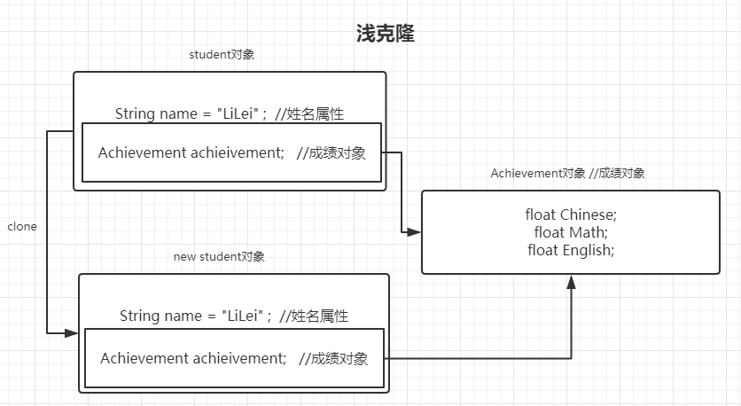
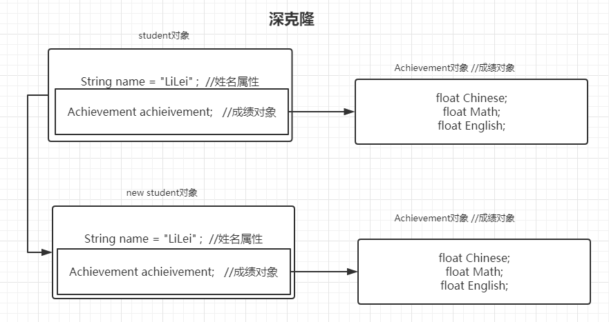
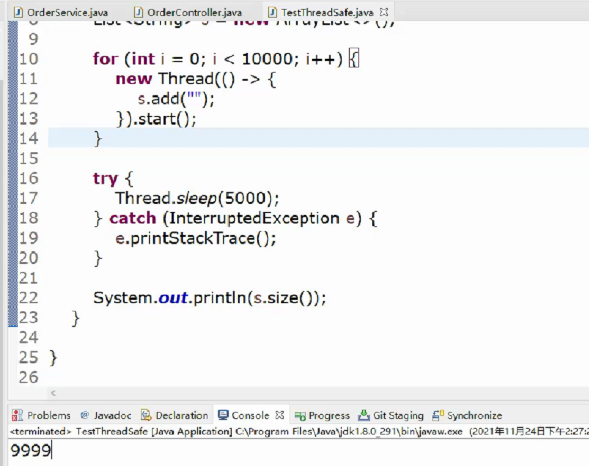
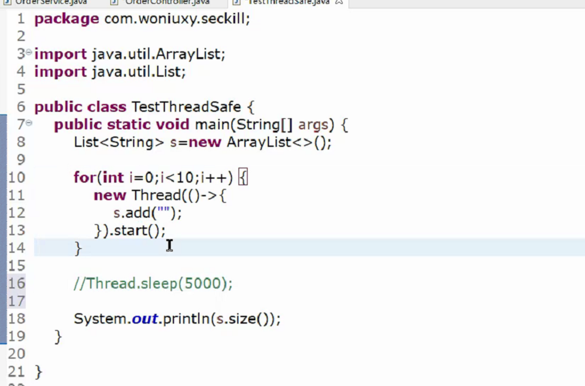
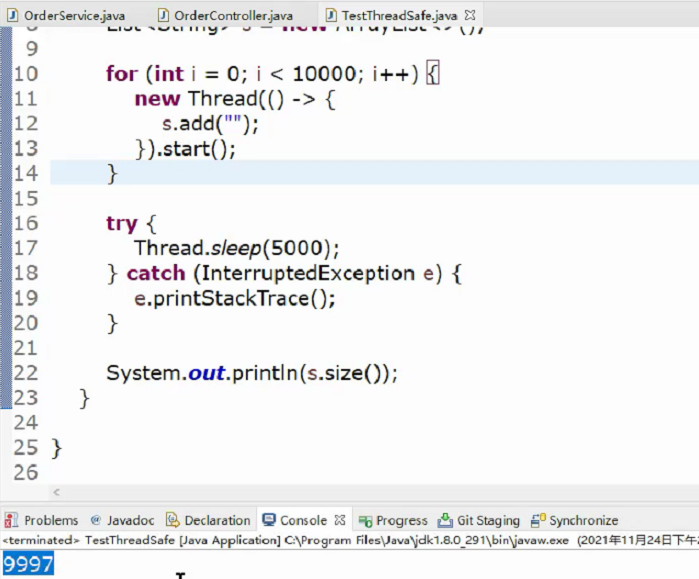
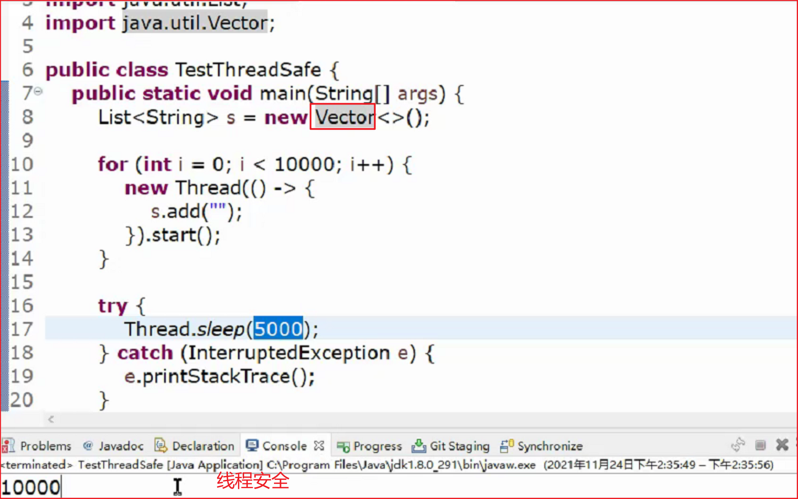
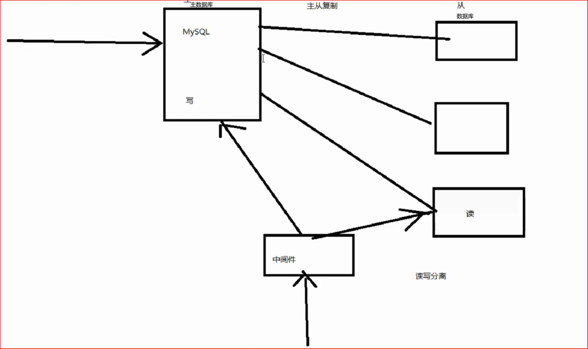
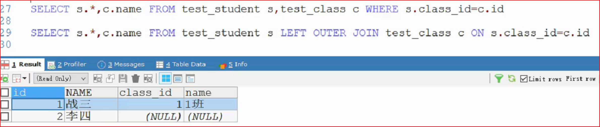

参考答案：简洁明了，尽可能能背下来，有理解分析：先解释概念，再介绍。

# 如何理解Java的跨平台

java源代码从编译到执行需要经历`编译`和`解释`两个步骤。
编译：javac将源文件编译成字节码文件。
解释：jvm将字节码文件中的内容逐行解析成01组成的二进制信息。
字节码文件固定，不同的os对应的jvm虚拟机，不同平台安装不同的虚拟机即可解释相同的字节码文件，然后执行，实现跨平台。

**`参考答案：`**

跨平台：是指Java代码编译一次，可以无需修改在不同的平台上运行。

跨平台原理：跨平台取决于JVM不同平台上的实现，这写JVM都遵循JVM规范，对于编译之后的class文件就能正常运行。

# JVM，JRE及JDK的关系

JDK（Java Development Kit）是针对Java开发员的产品，是整个Java的核心，包括了Java运行环境JRE、Java工具和Java基础类库。Java Runtime Environment（JRE）是运行JAVA程序所必须的环境的集合，包含JVM标准实现及Java核心类库。JVM是Java Virtual Machine（Java虚拟机）的缩写，是整个java实现跨平台的最核心的部分，能够运行以Java语言写作的软件程序。
jdk：Java development kits Java开发工具包，组成：jre+api工具类。
jre：Java runtime environment Java运行环境，主要为Java程序提供运行环境，组成：jvm+核心类库。
jvm：Java virtual machine Java虚拟机，程序运行的平台。
jdk>jre>jvm(不同的操作系统上存在不同的jvm，一次编译，处处运行)

**`参考答案：`**
JVM:lava虚拟机，JRE:lava运行环境，JDK:lava开发工具

JDk包含JRE+开发工具（Javac），JRE包含JVM+类库

# Java中的数据类型分类及特点：

基本数据类型
	整型：btye（1）、short（2）、int（4）、long（8）
	浮点型：float（4）、double（8）
	字符型：char（2）
	布尔型：Boolean（不定）

​	基本数据类型存储的真实的值，引用数据类型存储的是引用对象的地址。

引用数据类型

**`参考答案：`**

分为两类：

基本数据类型：8种，引用数据类型
特点：

基本数据类型存储位置是栈，引用类型存储位置是堆；

基本数据类型没有属性和方法，引用数据类型具有属性或方法

引申问题：int与Integer的区别：

# &与&&的区别

**`参考答案：`**

1、&没有短路的特点，&&有短路的特点

````java
int num=10;
if(num++>10&&--num<9){
	System.out.print("a");
}
System.out.print(num);//11
//10>10不成立，短路，不执行循环，但还需自增
````

2、参与&运算可以是整型，也可以是boolean，参与&&运算只能是boolean ；4&6=4

# 什么是方法的重载(Overload)

**`参考答案：`**

一个类中，方法名相同，参数不同（数量、类型、数量），重载与方法的返回值类型无关，可认为是相同方法的不同实现。

```java
public static  void m1(int num1){
        System.out.println("int num1");
    }

    
    public static void m1(Integer num1){
        System.out.println("Integer num1");
    }
    public static void m1(Number num1){
        System.out.println("Float num1");
    }
    public static void m1(float num1){
        System.out.println("float num1");
    }
    public static void m1(double num1){
        System.out.println("double num1");
    }
    public static void main(String[] args) {
        m1(1);
    }
```

# 什么是方法的重写(Override)

**`参考答案：`**

子类重写定义父类方法的实现

1、方法名一样

2、参数一样

3、访问控制修饰符不能变小

4、抛出的异常不能变大和更多

5、重写的方法返回值类型要么一样，要么是子类


重写与重载区别：

1、重载：在同一个类中，方法名相同，参数列表不同；编译时多态的实现

2、重写：在父子继承之间，子类中拥有和父类相同的方法；运行时多态的实现

# 描述Java中的访问控制修饰符

| 访问修饰符 | 本类（当前类） | 本包(同一个包) | 其它包的子类 | 其他包的其它类 |
| :--------: | :------------: | :------------: | :----------: | :------------: |
|   public   |       √        |       √        |      √       |       √        |
| protected  |       √        |       √        |      √       |                |
|    默认    |       √        |       √        |              |                |
|  private   |       √        |                |              |                |

**`参考答案：`**

可以使用访问控制修饰符来保护对类、变量、方法和构造方法的访问。

public：所修饰的成员，能被所有的代码访问到

protected：被本类，同一个包，子类访问

default：没有关键字，本类，同一个包中代码访问

private：所修饰的成员，能被本类的代码访问到

# 描述static关键字的使用

**`参考答案：`**

1，修饰类，只能是内部类

2，修饰方法，该方法是一个类的方法，访问该方法时通过`类名.方法名`进行调用，

3，修饰类的属性，属性也与对象没有任何关系，通过`类名.变量名`(类名.通常省略)调用

4，代码块，在类加载时执行

5，静态导入

```java
import static java.lang.System.out;
public class StaticImportTest {
        public static void main(String[] args) {
				//您的代码现在可以在程序中使用名称out表示System.out。编译器将使用静态进口报关来解析名称out来System.out。
                out.println("Hello static import!");
         }
}
```

# 描述final关键字的使用

**`参考答案:`**

final修饰类：类不可被继承，举例jdk指定final类：String

final修饰方法：方法不可被重写

final修饰变量：变量不能再次赋值（不可修改）

# 描述this关键字的使用

this代表对象的引用，哪个对象在调用this所在的方法，this就代表哪个对象

this()：`调用本类其他构造器`

**`参考答案`**

在构造方法中使用：this() 访问该类的其他形式的构造方法，this.属性/方法，访问本类中的属性或方法

其他场景：普通方法中，this.属性/方法，访问本类中的属性或方法

注意：static场景下，不能使用this

this在运行时指代当前对象

# 描述super关键字的使用

super代表从父类继承过来的东西。`(继承父类的方法等)

super() 必须放置在代码的第1行，一般用于 父类去帮组子类 定义某些属性时

**`参考答案`**

在构造方法中使用：super() 访问该类的父类的构造方法，super.属性/方法，访问父类中的属性或方法

其他场景：普通方法中，super.属性/方法，访问父类中的属性或方法

注意：static场景下，不能使用super

super在运行时指代父类对象，但是直接使用

# 描述instanceof关键字的使用

instanceof关键字：判断一个对象是否属于某一个类，返回值是一个布尔值

**`参考答案`**

instanceof用于判断对象是不是一个指定的类型

null判断时不属于任何类型

# 类的初始化顺序

父类–静态变量/父类–静态初始化块
子类–静态变量/子类–静态初始化块
父类–变量/父类–初始化块
父类–构造器
子类–变量/子类–初始化块
子类–构造器

**`参考答案`**

父类的静态代码块，只会执行一次

子类静态代码块，只会执行一次

父类代码块

父类构造方法

子类代码块

子类构造方法


有可能一道代码阅读

# 抽象类和接口的区别

相同点：
 1、都不能被实例化。
 2、接口的实现类和抽象类的子类只有全部实现了接口或者抽象类中的方法后才可以被实例化。
 不同点：
 1、接口只能定义抽象方法不能实现方法，抽象类既可以定义抽象方法，也可以实现方法。
 2、单继承，多实现。接口可以实现多个，只能继承一个抽象类。
 3、接口强调的是功能，抽象类强调的是所属关系。
 4、接口中的所有成员变量 为public static final， 静态不可修改，当然必须初始化。接口中的所有方法都是public abstract 公开抽象的。而且不能有构造方法。抽象类就比较自由了，和普通的类差不多，可以有抽象方法也可以没有，可以有正常的方法，也可以没有。

**`参考答案`**

语法

   	abstract extends
   	
   	interface  implements

使用

​	  抽象类表示类型   is  a  

​	  接口：具有某种能力（Iterable,Srilazable）,like a;  约定


  抽象类单继承，接口实现多个

# ==与equals的区别

**`参考答案`**

1、==参与运算的可以是两个基本数据类型  ，比较的是值；也可以是两个引用类型 ，比较的是地址；  equals只能由对象调用

2、默认情况下，equals和==是一样的，比较的是地址。一般开发中会重写equlas方法实现自己的比较逻辑（如比较的是对象的内容）

# String，StringBuffer及StringBuilder的区别

String长度不可变，StringBuffer及StringBuilder长度可变。

1、StringBuffer多线程安全的，StringBuilder多线程不安全

2、StringBuffer从JDK 1.0就有了，StringBuilder是JDK 5.0才出现

3、StringBuffer比StringBuilder多了一个toStringCache字段，用来在toString方法中进行缓存，每次append操作之前都先把toStringCache设置为null，若多次连续调用toString方法，可避免每次Arrays.copyOfRange(value, 0, count)操作，节省性能。

**`参考答案`**

String是不可变的，StringBuffer及StringBuilder是可变的

StringBuffer线程安全，StringBuilder线程不安全

# 怎么理解String的不可变

**`参考答案:`**

final修饰类，不能被继承

String中存储数据内部一个属性，final修饰的字符数组

String类中声明的方法返回新的String对象


String分配到内存中之后，不可在原来的内存空间上修改值


扩展：1，就要该其中的字符数组，怎么办？  反射  2，自己设计一个不可变的类，怎么做

# 浅克隆与深克隆

克隆，即复制一个对象，该对象的属性与被复制的对象一致。

浅克隆：复制对象时仅仅复制对象本身，包括基本属性，但该对象的属性引用其他对象时，该引用对象不会被复制，即拷贝出来的对象与被拷贝出来的对象中的属性引用的对象是同一个。

深克隆：复制对象本身的同时，也复制对象包含的引用指向的对象，即修改被克隆对象的任何属性都不会影响到克隆出来的对象。





继续拷贝：拷贝对象的内容，而非地址值

**`参考答案:`**

浅克隆：将对象的属性克隆一份到新的对象中，属性无论是基本类型还是引用类型，都是克隆其值

深克隆：属性是基本类型，克隆值，引用类型，继续进行拷贝


扩展：代码如何实现？

# Java集合框架的层次


**`参考答案:`**

Java Collection Framework：JCF

Collection

​	List

​		ArrayList

​	    LinkedList

​	Set

​			HashSet

​			TreeSet

​    Queue

Map

  HashMap

   TreeMap

# List与Set的区别

**（1）重复对象**

list方法可以允许重复的对象，而set方法不允许重复对象

**（2）null元素**

list可以插入多个null元素，而set只允许插入一个null元素

**（3）容器是否有序**

list是一个有序的容器，保持了每个元素的插入顺序。即输出顺序就是输入顺序，而set方法是无序容器，无法保证每个元素的存储顺序，TreeSet通过 Comparator 或者 Comparable 维护了一个排序顺序

**（4）常用的实现类**

list方法常用的实现类有ArrayList、LinkedList 和 Vector。其中ArrayList 最为流行，它提供了使用索引的随意访问，而LinkedList 则对于经常需要从 List 中添加或删除元素的场合更为合适，Vector 表示底层数组，线程安全

Set方法中最流行的几个实现类是 HashSet、LinkedHashSet 以及 TreeSet。最流行的是基于 HashMap实现的 HashSet；TreeSet 还实现了 SortedSet 接口，因此 TreeSet 是一个根据其 compare() 和compareTo() 的定义进行排序的有序容器

接口不要从实现来说，不同的实现底层不同。

**`参考答案:`**

1，List，有序，可重复，可以使用索引获取元素

2，Set，不保证顺序，不重复，不可以使用索引获取元素

# ArrayList的实现原理

**`参考答案:`**

new ArrayList():初始化一个空的数组

add:检查数组的元素是否已满，满了容量增加一半

后面自己实现基于数据的List实现

# LinkedList的实现原理

**`参考答案:`**

双向链表，

add：默认加到链表的末尾，也可以指定位置

get：根据位置和元素的数量一半比较

# 什么是自动拆箱与自动装箱

**`参考答案:`**

Java5引入自动拆箱与装箱

拆箱：包装类转换为对应的基本数据类型

装箱：基本数据类型转换为对应的包装类

# IO中的流有哪些分类

**`参考答案:`**

按照流向：输入流（InputStream，Reader），输出流（OutputStream，Writer）

按照数据类型：字节流（InputStream，OutputStream），字符流（Reader，Writer）

# 什么是序列化与反序列化

**把对象转换为字节序列的过程称为对象的序列化**。

**把字节序列恢复为对象的过程称为对象的反序列化**。
　　对象的序列化主要有两种用途：
　　1） 把对象的字节序列永久地保存到硬盘上，通常存放在一个文件中；
　　2） 在网络上传送对象的字节序列。

　　在很多应用中，需要对某些对象进行序列化，让它们离开内存空间，入住物理硬盘，以便长期保存。比如最常见的是Web服务器中的Session对象，当有 10万用户并发访问，就有可能出现10万个Session对象，内存可能吃不消，于是Web容器就会把一些seesion先序列化到硬盘中，等要用了，再把保存在硬盘中的对象还原到内存中。

　　当两个进程在进行远程通信时，彼此可以发送各种类型的数据。无论是何种类型的数据，都会以二进制序列的形式在网络上传送。发送方需要把这个Java对象转换为字节序列，才能在网络上传送；接收方则需要把字节序列再恢复为Java对象。

**`参考答案:`**

序列化：内存中的对象能够转换为字节类型的数据，反序列化账号相反

一般使用场景：将对象从内存存储到磁盘上，对象在网络上传输

# transient关键字的作用

1、transient关键字只能修饰变量，而不能修饰方法和类。注意，本地变量是不能被transient关键字修饰的。
2、被transient关键字修饰的变量不再能被序列化，一个静态变量不管是否被transient修饰，均不能被序列化。
3、一旦变量被transient修饰，变量将不再是对象持久化的一部分，该变量内容在序列化后无法获得访问。也可以认为在将持久化的对象反序列化后，被transient修饰的变量将按照普通类成员变量一样被初始化。

**`参考答案:`**

翻译为瞬时，使用该关键字修饰的属性不会被序列化

# serialVersionUID有什么用

serialVersionUID适用于Java的序列化机制。简单来说，Java的序列化机制是通过判断类的serialVersionUID来验证版本一致性的。在进行反序列化时，JVM会把传来的字节流中的serialVersionUID与本地相应实体类的serialVersionUID进行比较，如果相同就认为是一致的，可以进行反序列化，否则就会出现序列化版本不一致的异常，即是InvalidCastException。

**具体的序列化过程是这样的**：序列化操作的时候系统会把当前类的serialVersionUID写入到序列化文件中，当反序列化时系统会去检测文件中的serialVersionUID，判断它是否与当前类的serialVersionUID一致，如果一致就说明序列化类的版本与当前类版本是一样的，可以反序列化成功，否则失败。

serialVersionUID有两种显示的生成方式：     
一是默认的1L，比如：private static final long serialVersionUID = 1L;     
二是根据类名、接口名、成员方法及属性等来生成一个64位的哈希字段，比如：     
private static final long  serialVersionUID = xxxxL;

**`参考答案:`**

目的是保证序列化和反序列化正常运行，如果该属性不同，会失败

定义：private static final long serialVersionUID=1L;

# 异常的分类及特点

**(1) 运行时异常**

**定义**:RuntimeException及其子类都被称为运行时异常。

**特点**:Java编译器不会检查它。也就是说，当程序中可能出现这类异常时，倘若既"没有通过throws声明抛出它"，也"没有用try-catch语句捕获它"，还是会编译通过。例如，除数为零时产生的ArithmeticException异常，数组越界时产生的IndexOutOfBoundsException异常，fail-fail机制产生的ConcurrentModificationException异常等，都属于运行时异常。

虽然Java编译器不会检查运行时异常，但是我们也可以通过throws进行声明抛出，也可以通过try-catch对它进行捕获处理。

如果产生运行时异常，则需要通过修改代码来进行避免。例如，若会发生除数为零的情况，则需要通过代码避免该情况的发生！

**(2) 被检查的异常**

**定义**:Exception类本身，以及Exception的子类中除了"运行时异常"之外的其它子类都属于被检查异常。

**特点**:Java编译器会检查它。此类异常，要么通过throws进行声明抛出，要么通过try-catch进行捕获处理，否则不能通过编译。例如，CloneNotSupportedException就属于被检查异常。当通过clone()接口去克隆一个对象，而该对象对应的类没有实现Cloneable接口，就会抛出CloneNotSupportedException异常。

**`参考答案:`**

受检（checked）异常，运算时（Runtime）异常

1，受检异常是Exception及其子类（除RuntimeException除开），RuntimeException及其子类属于运行时异常

2，受检异常需要显式处理（try，throws），运行时异常不用显式处理

3,开发中通常自定义的异常是运行时异常

# 枚举的特点及使用场景

1.用enum定义枚举类默认继承了Java.lang.Enum类而不是继承了Object类。其中java.lang.Enum类实现了java.lang.Serializable和java.lang.Comparable两个接口；

2.枚举类的构造函数只能使用private访问修饰符，如果省略了其构造器的访问控制符，则默认使用private修饰；

3.枚举类的所有实例必须在枚举类中显式列出，否则这个枚举类将永远都不能产生实例。列出这些实例时，系统会自动添加public static final修饰，无需程序员显式添加。

当变量只能从一些固定的值中取值时，可以使用枚举。如：日期，学习，职业等等。使用枚举可以规避魔法值。

**`参考答案:`**

拥有特定数量的实例

实体类中使用枚举表示各种具有有限值的属性

统一响应格式，枚举表示响应码

# 反射的概念及作用

反射：程序运行时可以动态创建对象，操作对象的成员（属性和方法等）

通过反射可以使程序代码访问装载到JVM 中的类的内部信息

1、获取已装载类的属性信息

2、 获取已装载类的方法

3、获取已装载类的构造方法信息

**`参考答案:`**

动态获取类的信息，创建实例，访问属性及方法

转换查询的结果集为集合类型

统一处理HTTP请求

实现框架：MyBatis，Spring

# 动态代理的使用场景

- 统计每个 api 的请求耗时

- 统一的日志输出

- 校验被调用的 api 是否已经登录和权限鉴定

- Spring的 AOP 功能模块就是采用动态代理的机制来实现切面编程

**`参考答案:`**

声明式事务

Mapper接口

统一异常处理

统一日志记录

# cglib与jdk动态代理的区别

1、代理原理不一样，JDK代理是属于接口代理，实现类上一定要有个接口，代理工厂产生的代理类和真实类之间是 朋友关系；

而CGLIB 代理属于子类代理，代理工厂产生的代理类 和真实类之间是 父子关系（真实类是父，代理类是子）！

2、JDK代理通过JVM底层在内存中根据接口，动态产生一个代理实例出来。而Cglib是依靠ASM 字节码框架才能产生，不是JDK自带的。

**`参考答案:`**

cglib来自第三方开源包，jdk代理是自带的

cglib代理普通类，jdk代理的类需要实现接口

API：

# 请解释进程与线程的区别

根本区别：进程是操作系统资源分配的基本单位，而线程是任务调度和执行的基本单位

在开销方面：每个进程都有独立的代码和数据空间（程序上下文），程序之间的切换会有较大的开销；线程可以看做轻量级的进程，同一类线程共享代码和数据空间，每个线程都有自己独立的运行栈和程序计数器（PC），线程之间切换的开销小。

所处环境：在操作系统中能同时运行多个进程（程序）；而在同一个进程（程序）中有多个线程同时执行（通过CPU调度，在每个时间片中只有一个线程执行）

内存分配方面：系统在运行的时候会为每个进程分配不同的内存空间；而对线程而言，除了CPU外，系统不会为线程分配内存（线程所使用的资源来自其所属进程的资源），线程组之间只能共享资源。

包含关系：没有线程的进程可以看做是单线程的，如果一个进程内有多个线程，则执行过程不是一条线的，而是多条线（线程）共同完成的；线程是进程的一部分，所以线程也被称为轻权进程或者轻量级进程。

**`参考答案:`**

进程：分配内存的最小单位，进程中的数据互不相干，

线程：分配CPU的最小单位，线程中的数据共用

进程是有若干线程组成，一个线程在一个进程里

# 如何创建线程

1）继承Thread类创建线程

2）实现Runnable接口创建线程

3）使用Callable和Future创建线程

4）使用线程池例如用Executor框架

**`参考答案:`**

继承Thread

实现Runnable

线程池

# sleep和wait的区别

1、来自不同的类：sleep是Thread的静态类方法，谁调用的谁去睡觉，即使在a线程里调用了b的sleep方法，实际上还是a去睡觉，要让b线程睡觉要在b的代码中调用sleep。

2、有没有释放锁(释放资源)：sleep不出让系统资源;wait是进入线程等待池等待，出让系统资源，其他线程可以占用CPU。

3、一般wait不会加时间限制，因为如果wait线程的运行资源不够，再出来也没用，要等待其他线程调用notify/notifyAll唤醒等待池中的所有线程，才会进入就绪队列等待OS分配系统资源。sleep(milliseconds)可以用时间指定使它自动唤醒过来，如果时间不到只能调用interrupt()强行打断。

4、sleep必须捕获异常，而wait，notify和notifyAll不需要捕获异常。

**`参考答案:`**

sleep来自于Thread类，wait来自Object

sleep不会释放锁，wait会释放锁

sleep到指定的时间唤醒，wait是notify，notifyAll

# synchronized关键字有何作用

Java 中关键字 synchronized 表示只有一个线程可以获取作用对象的锁，执行代码，阻塞其他线程。

作用：

- 确保线程互斥地访问同步代码
- 保证共享变量的修改能够及时可见
- 有效解决重排序问题


多线程，跨时间片

修饰代码块，锁加在对象上？

**`参考答案:`**

修饰方法：

   修饰普通非静态方法，锁加到该方法的对象上

   修饰的是静态方法，锁加到该类的class上

修饰代码块

​    synchronized(this)

   synchronized(class)

# 什么是线程不安全，请举例说明

arrayList、hashMap等集合线程不安全，可以使用JUC包中的安全集合类代替。

**`参考答案:`**

多个线程同时操作相同的数据，导致数据不一致

```java
List<String> s = new ArrayList<>();

for (int i = 0; i < 10000; i++) {
    new Thread(() -> {
        s.add("");
    }).start();
}

try {
    Thread.sleep(5000);
} catch (InterruptedException e) {
    e.printStackTrace();
}

System.out.println(s.size());
```


LInkedLIst，ArrayList，Vector










# 用过哪些原子类

**`参考答案:`**

来自JUC的，提供各种数据的原子操作，其中有：AtomicInteger，AtomicReference，AtomicLongArray

# 并发容器有哪些

**`参考答案:`**

来自JUC，CopyOnWriteArrayList，ConcurrentHashMap，...

扩展：常见的并发集合的实现原理

# MySQL的引擎有哪些，有什么特点

**`参考答案:`**

InnoDB:支持事务，外键

MyISAM：不支持事务，不支持外键

在读写分离场景下，InnoDB适合用于写数据库，MyISAM适合读数据库




# 外连接的使用场景

**`参考答案:`**

查询外键值为空的数据适合使用外连接

```sql
CREATE TABLE test_class(
	id INT PRIMARY KEY AUTO_INCREMENT,
	NAME VARCHAR(5) NOT NULL
);

CREATE TABLE test_student(
	id INT PRIMARY KEY AUTO_INCREMENT,
	NAME VARCHAR(5) NOT NULL,
	class_id INT 
);

ALTER TABLE test_student
  ADD CONSTRAINT fk_class_id
      FOREIGN KEY(class_id) REFERENCES test_class(id);
      
      
INSERT INTO test_class(NAME) VALUES('1班'),('2班');

SELECT * FROM test_class;

INSERT INTO test_student(NAME,class_id) VALUES('战三',1),('李四',NULL);

SELECT * FROM test_student;


SELECT s.*,c.name FROM test_student s,test_class c WHERE s.class_id=c.id

SELECT s.*,c.name FROM test_student s LEFT OUTER JOIN test_class c ON s.class_id=c.id
```



# 描述get与post的区别

**`参考答案:`**

get：参数跟上URL上，问号隔开，称为查询字符串,post把参数放在请求体中

post相对get更加安全

get的发送数据小，post发送数据大，文件上传使用post

```java
class Test{
	private Test(){}
	private static Test test=new Test0;
    public static Test getIsntance(){
      return test;
	}
public static int num=0;
}

Test.num;
```

# Servlet的生命周期

**`参考答案:`**

1，默认情况下，Servlet是在首次访问时，加载，调用构造方法进行实例化，调用init方法进行初始化，使用service处理请求，当项目卸载或者容器正常停止，调用destroy进行销毁

2，配置了load-on-startup属性时，在容器加载项目时，会自动加载servlet，调用构造方法进行实例化，调用init方法进行初始化；当请求访问该Servlet。使用service处理请求，当项目卸载或者容器正常停止，调用destroy进行销毁

# 前台重定向与后台转发的区别

**`参考答案:`**

前台重定向，服务器端发送一个状态码为302的响应，同时带回去location；浏览器发送是这样的响应，继续发送请求到location指定的URL，后台转发，服务器直接找到资源作为响应发往浏览器

地址栏变化，不变化

数据存储去request作用域中，前台重定向不会共享数据，后台转发可以

# Cookie与Session的关系及区别

**`参考答案:`**

当浏览器第一次访问服务器时，服务器端会产生一个Cookie，在响应头中带回（jsesssionid），同时服务器端还会产生HttpSession类型的实例，属性id和jsesssionid一致，浏览器会存储到本地，当后续继续发请求是，在请求头中将cookie带上；

Session存储服务器，Cookie存储在客户端

# JSP的执行原理

**`参考答案:`**

当第一次访问JSP页面时，容器会将其翻译为一个Java类，就是Servlet；后续再次访问该JSP时，不会再重复翻译为Servlet

# JSP的隐式对象有哪些

**`参考答案:`**

request：

response

pageContext

session

application

config

out

page

exception：异常，只有在page指令中使用isErrorPage=true才可用

# JSP中的作用域有哪些

**`参考答案:`**

pageContext,request,session,application

实际开发中，最常用的request，但是session存储登录用户的信息，

# 你如何理解分层结构的

**`参考答案:`**

开发时将代码从逻辑上按照代码的功能进行分层，通常分为3层。

数据访问层：封装了访问持久化设备的方法，在这一层只需要关心数据的CRUD，不用关心业务及事务。

业务逻辑层：封装业务的逻辑操作，控制事务的边界。

视图层（表现层）：主要负责用户界面的展示，获取用户的输入。

设计分层结构时：

1、解耦，针对接口编程，下一层的异常需要封装为自定义异常|（持久层框架分装了异常，而业务层需要自定义异常）

2、数据传递：VO、DTO、PO（通常需要的数据列比数据库中的列数少，就需要定义各种数据传递对象）

好处：职责分明，维护性高

项目中：体现出分层，使用MyBatis实现数据访问层，SpringBoot实现视图层

# 什么是MVC

**`参考答案:`**

MVC是指Model，View，Controller

 Model：模型，提供了数据操作的功能

View：用户的界面

Controller：控制器，接收用户请求，返回视图给用户

设计：view是不允许直接访问的，所有的请求一律走Controller（SpringMVC使用DspatcherServlet，Strus使用Filter）

​				view是显示数据，数据是Controller访问Model获取的，需要存在作用域中

​			（jsp不应直接接收请求，应放在webinf中，由controller去访问，实际中直接请求jsp）

好处：可维护性

项目：Servlet，SpringMVC

# MyBatis的优缺点

**`参考答案:`**

优点：原IDBC减少了，结果集的自动转换，SQL语句可以自己优化

缺点：自己写SQL

# 当实体类中的属性名和表中的字段名不一样 ，怎么办

**`参考答案:`**

在sql语句取别名

使用ResultMap

# MyBatis中Mapper接口的工作原理是什么

**`参考答案:`**

1、读取config文件，从其中找到mapper 文件的位置，读取其中的内容，会在内存中使用合适的类的实例保存这些信息，它会将mapper中的namespace和标签的id连接起来作为map的键，值就是sql

2、获取Mapper接口的实例时，会产生一个JDK的代理，代理中实现逻辑：

​	获取该方法所在接口的全限定名，和方法名拼接，将结果到上一步的map中查询sql语句，解析sql中的占位符，执行

3、执行结果如果是ResultSet，接着使用反射将ResultSet转换为Java中的数据类型

# 如何获取数据库自动生成的主键值

**`参考答案:`**

XML  insert useGenerateKey=true   keyProperty="id"

注解：@Options()

# 数据库连接池的实现原理

数据库连接的建立和关闭是极其耗费系统资源的操作，每次操作都打开一个物理连接，使用完后立即关闭连接。频繁的建立、关闭连接将造成系统性能的低下。连接池的目的就是为了做到连接的复用，以及对连接的有效控制。在系统启动时，就主动建立足够的数据库连接，并将这些连接组成一个连接池。每次应用程序请求数据库连接时，无须重新建立连接，而是从连接池中取出已有的连接使用，使用完毕后不再关闭数据库连接，而是直接将连接归还给连接池。

datasource数据源就是数据库连接池。

**`参考答案:`**

系统启动时，初始化若干的连接放在内存中。

当需要连接数据库时，首先连接到连接池中的空闲连接，如果找到了，直接使用，同时将连接设置为“正在使用”，当使用完成后，将连接还回连接池；如果找不到空闲的连接，判断是否到达最大连接数，如果没有到最大连接数，创建新的连接，如果到达最大连接数，等待指定的时间，如再这段时间有空闲的连接可用，直接用，否则报错。|

当指定的时间内，没有客户端去连接数据库，可以将连接物理上关闭。


# Spring中的IOC

IOC即Inversion of Control 控制反转，以前在程序中都是通过new关键字创建对象，这是一个主动创建的过程，而在spring中，对象都由spring创建并被纳入管理，我们只需要从容器中拿到已有的对象进行使用而无需自己创建，创建对象的控制权被spring接管了，即控制反转。

**`参考答案:`**

概念：Inverse Of Controll，控制反转

解释：将创建对象的过程交由Spring

好处：解耦，维护性，灵活性有好处

项目：针对接口编程，上一层访问下一层，使用的是接口，在运行时由Spring动态注入

# Spring中的AOP

AOP即Aspect Oriented Programming 面向切面编程。AOP 要达到的效果是，保证在不修改源代码的前提下，去为系统中的业务组件添加某种通用功能。

AOP利用一种称为"横切"的技术，剖解开封装的对象内部，并将那些影响了多个类的公共行为封装到一个可重用模块，并将其命名为"Aspect"，即切面。所谓"切面"，简单说就是那些与业务无关，却为业务模块所共同调用的逻辑或责任封装起来，便于减少系统的重复代码，降低模块之间的耦合度，并有利于未来的可操作性和可维护性。

使用：异常处理、事务

**`参考答案:`**

概念：Aspect Orited Of Programming，面向切面编程

解释：将系统中交叉功能与业务功能的实现分开，交叉功能的实现就是切面，通常使用动态代理实现

好处：解耦，维护性，灵活性有好处

项目：声明式事务，统一异常处理，操作日志的记录

# Spring中事务的实现方式

基于 @Transactional 的声明式事务管理


实现spring事务的四种方式分别为：
（1）编程式事务管理：需要手动编写代码，在实际开发中很少使用
（2）声明式事务管理：
（2.1）基于TransactionProxyFactoryBean的方式，需要为每个进行事务管理的类做相应配置
（2.2）基于AspectJ的XML方式，不需要改动类，在XML文件中配置好即可
（2.3）基于注解的方式，配置简单，需要在业务层类中添加注解

**`参考答案:`**

注解  @Transactional

XML：tx命名空间，aop命名空间

# 系统如何解耦

对于复杂的服务可以拆分为小的服务，即采用微服务架构；

服务内部根据代码的功能分层，各层之间使用接口调用。

**`参考答案:`**

单体应用：分层结构中，针对接口编程，下一层异常进行统一设计

微服务：使用消息队列

# Spring中@Transactional什么情况下失效

1、如果某个方法是**private**的，那么@Transactional就会失效，因为底层**cglib**是基于父子类来实现的，子类是不能重载父类的**private**方法，所以无法很好利用代理，这种情况下会导致@Transactional失效

2、使用的数据库引擎不支持事务，例如在使用**mysql**的时候使用**MyISAM**引擎不支持事务，**InnoDB**支持，并且从**mysql5.5**之后开始默认的存储引擎就为**InnoDB** 。

3、@Transactional注解的方法不能在同一个类中调用，否则会使事务失效！（因为**Spring**事务是基于代理来实现的，所以某个加了**@Transactional**的方法只有是被代理对象调用时，那么这个注解才会生效，所以当被代理对象来调用这个方法那么事务就不会生效，）

4、@**Transactional** 注解属性 **propagation** 设置错误，若是错误的配置以下三种 **propagation** ，事务将不会发生**回滚**：

- **`TransactionDefinition.PROPAGATION_SUPPORTS`：**如果当前存在事务，则加入该事务；如果当前没有事务，则以非事务的方式继续运行。

- **`TransactionDefinition.PROPAGATION_NOT_SUPPORTED`：**以非事务方式运行，如果当前存在事务，则把当前事务挂起。

- **`TransactionDefinition.PROPAGATION_NEVER`：**以非事务方式运行，如果当前存在事务，则抛出异常。
- 5、@**Transactional** 注解属性 **rollbackFor** 设置错误：**`rollbackFor`** 可以指定能够触发[事务回滚](https://www.zhihu.com/search?q=事务回滚&search_source=Entity&hybrid_search_source=Entity&hybrid_search_extra={"sourceType"%3A"article"%2C"sourceId"%3A403935250})的异常类型。**Spring**默认抛出了未检查**`unchecked`**异常（继承自**`RuntimeException`** 的异常）或者 **`Error`**才回滚事务；其他异常不会触发回滚事务。如果在事务中抛出其他类型的异常，但却期望 Spring 能够回滚事务，就需要指定 **rollbackFor**属性。

6、异常被 catch 了 导致@**Transactional**失效：当事务方法中抛出一个异常后，应该是需要表示当前事务需要 **`rollback`** ，如果在事务方法中手动捕获了该异常，那么事务方法则会任务当前事务应该正常 **`commit`**，此时就会出现事务方法中明明有报错信息表示当前事务需要 rollback 但是事务方法任务是正常，出现了前后不一致，也是因为这样就会抛出 **`UnexpectedRollbackException`**异常。
`spring`的事务是在调用业务方法之前开始的，业务方法执行完毕之后才执行**`commit` or `rollback`**，事务是否执行取决于是否抛出`**runtime**异常`。如果抛出**`runtime exception`** 并在你的业务方法中没有**catch**到的话，事务会**回滚**。
在业务方法中一般不需要[catch异常](https://www.zhihu.com/search?q=catch异常&search_source=Entity&hybrid_search_source=Entity&hybrid_search_extra={"sourceType"%3A"article"%2C"sourceId"%3A403935250})，如果非要catch一定要抛出**`throw new RuntimeException()`**，或者注解中指定抛异常类型**`@Transactional(rollbackFor=Exception.class)`**，否则会导致事务失效，数据commit造成数据不一致，所以有些时候try catch反倒会画蛇添足。

**`参考答案:`**

1，数据库支持

2，代理失效

3，异常类型


public void m1(){

m2();

}


@Transactional

public void m2(){

}

# SpringMVC处理请求的流程

**`参考答案:`**

基本的SpringMVC中启动流程

web.xml


# 什么是SpringBoot的自动配置

**`参考答案:`**

当SpringBoot启动时，程序会解析run方法中的第一个参数，目的是去解析@SpringBootApplication，最终使用@Import注解

该注解：将类路径中的jar，找到其中META-INF/spring.factories文件，该文件中声明了若干需要加载的类的全限定名，这些类通常是歌剧某种条件加载自己声明的Bean


# SpringBoot的启动流程(Web项目)

**`参考答案:`**

当SpringBoot中配置了spring-boot-starter-web时，会按照Tomcat.class，UpgradeProtocol判断是否创建Tomcat，还会创建DispatcherServlet，


# 如何实现SpringBoot的starter

**`参考答案:`**

自行实现


# 微服务架构有何优缺点

**`参考答案:`**

将大的功能拆分为小的服务，独立开发，独立测试，独立部署，独立运行，独立存储，开发时会比较独立，

单个服务维护简单


调用出现网络问题，数据不一致

运维有困难，服务多，成本高


# SpringCloud有哪些组件，主要是什么作用

**`参考答案:`**

# Gateway提供的作用有哪些

**`参考答案:`**

路由，统一认证，限流

# Redis的使用场景有哪些？

**`参考答案:`**

Redis的数据类型

针对数据结构常用的命令


使用场景：热点数据的缓存，Token,分布式锁，幂等性；https://www.jianshu.com/p/40dbc78711c8

我们项目哪个地方：尽可能找几个，实在没有，设计一个


# Redis雪崩是什么意思，怎么解决

**`参考答案:`**

在`高并发`下，大量缓存key在`同一时间失效`，大量请求直接落在数据库上，导致数据库宕机。

**解决方案**

- 随机设置key失效时间，避免大量key集体失效。

 setRedis（Key，value，time + Math.random() * 10000）； 复制代码
 若是[集群部署](https://www.zhihu.com/search?q=集群部署&search_source=Entity&hybrid_search_source=Entity&hybrid_search_extra={"sourceType"%3A"answer"%2C"sourceId"%3A1482420252})，可将热点数据均匀分布在不同的Redis库中也能够避免key全部失效问题
 不设置过期时间
 跑定时任务，在缓存失效前刷进新的缓存

# Redis穿透是什么意思，怎么解决

**`参考答案:`**

`redis缓存`和`数据库`中没有相关数据(例用户直接携带`id<=0`的参数不断发起请求)，redis中没有这样的数据，`无法进行拦截`，直接被穿透到`数据库`，导致数据库压力过大宕机。

对不存在的数据缓存到redis中，设置key，value值为null(不管是数据未null还是系统bug问题)，并设置一个短期过期时间段，避免过期时间过长影响正常用户使用。


拉黑该IP地址


对参数进行校验，不合法参数进行拦截


[布隆过滤器](https://www.zhihu.com/search?q=布隆过滤器&search_source=Entity&hybrid_search_source=Entity&hybrid_search_extra={"sourceType"%3A"answer"%2C"sourceId"%3A1482420252}) 将所有可能存在的数据[哈希](https://www.zhihu.com/search?q=哈希&search_source=Entity&hybrid_search_source=Entity&hybrid_search_extra={"sourceType"%3A"answer"%2C"sourceId"%3A1482420252})到一个足够大的bitmap(位图)中，一个一定不存在的数据会被 这个bitmap拦截掉，从而避免了对底层存储系统的查询压力。


击穿

`某一个`[热点key](https://www.zhihu.com/search?q=热点key&search_source=Entity&hybrid_search_source=Entity&hybrid_search_extra={"sourceType"%3A"answer"%2C"sourceId"%3A1482420252})，在不停地扛着高并发，当这个热点key在`失效的一瞬间`，持续的高并发访问就`击破缓存`直接访问数据库，导致数据库宕机。

设置热点数据"永不过期"


加上互斥锁：上面的现象是多个线程同时去查询数据库的这条数据，那么我们可以在第一个查询数据的请求上使用一个互斥锁来锁住它
 其他的线程走到这一步拿不到锁就等着，等第一个线程查询到了数据，然后将数据放到redis缓存起来。后面的线程进来发现已经有缓存了，就直接走缓存


redis与mysql双写一致性

MySQL主从数据不一致

Redis主从数据不一致


# 描述Redis线程模型

**`参考答案:`**

解析：

Redis基于Reactor模式开发了网络事件处理器，这个处理器被称为文件事件处理器（file event handler）。它的组成结构为4部分：多个套接字、IO多路复用程序、文件事件分派器、事件处理器。因为文件事件分派器队列的消费是单线程的，所以Redis才叫单线程模型。

- 文件事件处理器使用 I/O 多路复用（multiplexing）程序来同时监听多个套接字， 并根据套接字目前执行的任务来为套接字关联不同的事件处理器。
- 当被监听的套接字准备好执行连接应答（accept）、读取（read）、写入（write）、关闭（close）等操作时， 与操作相对应的文件事件就会产生， 这时文件事件处理器就会调用套接字之前关联好的事件处理器来处理这些事件。

虽然文件事件处理器以单线程方式运行， 但通过使用 I/O 多路复用程序来监听多个套接字， 文件事件处理器既实现了高性能的网络通信模型， 又可以很好地与 redis 服务器中其他同样以单线程方式运行的模块进行对接， 这保持了 Redis 内部单线程设计的简单性。

# \=\==\=\=\=\=\=\=\=\=\=\=\=\=\=\=\=\=\=\=\=

# mybatis一二级缓存

一级缓存默认开启，是sqlSession级别的，sqlSession对象中有一个数据结构存储缓存数据，不同的sqlSession之间的缓存数据区域是互相不影响的。用户发起查询请求，查找某条数据，sqlSession先去缓存中查找，是否有该数据，如果有，读取；如果没有，从数据库中查询，并将查询到的数据放入一级缓存区域，供下次查找使用。但sqlSession执行commit，即增删改操作时会清空缓存。这么做的目的是避免脏读。

二级缓存默认是关闭的，需要配置才能开启，同时使用二级缓存的POJO类实现Serializable接口。二级缓存是mapper级别的缓存，多个SqlSession去操作同一个Mapper的sql语句，多个SqlSession可以共用二级缓存，二级缓存是跨SqlSession的。二级缓存的作用范围更大。

想要使用二级缓存时需要想好两个问题：

1）对该表的操作与查询都在同一个namespace下，其他的namespace如果有操作，就会发生数据的脏读。

2）对关联表的查询，关联的所有表的操作都必须在同一个namespace。

https://www.cnblogs.com/yuluoxingkong/p/8205858.html


# RabbitMQ的五种队列

**简单队列**：一个生产者对应一个消费者

**work 模式**：一个生产者对应多个消费者，但是只能有一个消费者获得消息

**发布/订阅模式**：一个消费者将消息首先发送到交换器，交换器绑定到多个队列，然后被监听该队列的消费者所接收并消费

**路由模式**：生产者将消息发送到direct交换器，在绑定队列和交换器的时候有一个路由key，生产者发送的消息会指定一个路由key，那么消息只会发送到相应key相同的队列，接着监听该队列的消费者消费消息。

**主题模式**：路由模式是根据路由key进行完整的匹配（完全相等才发送消息），这里的通配符模式通俗的来讲就是模糊匹配。
